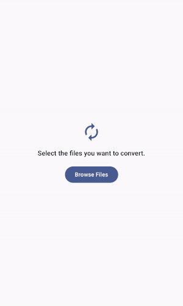

# Async Video Converter

  

### This project demonstrates asynchronous and parallel programming concepts by seamlessly converting videos to audio files while ensuring optimal performance.

## Support

For support, email malkoceren24@gmail.com .

## License

[MIT](https://choosealicense.com/licenses/mit/)